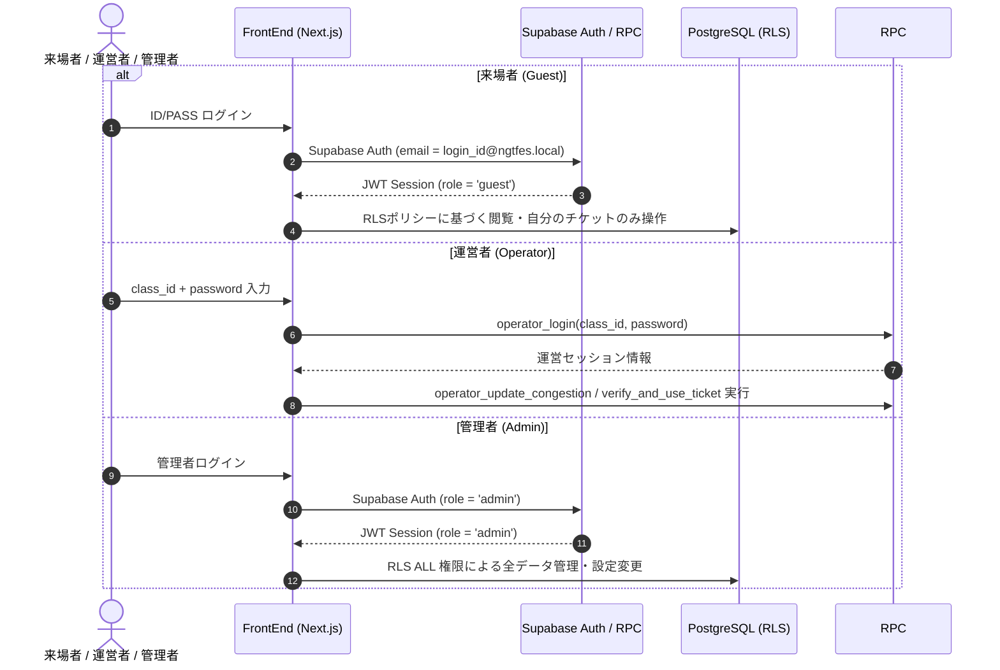

# NgtFes26 システムアーキテクチャ仕様書 (docs/architecture.md)

本ドキュメントは、長田高校文化祭 Web アプリケーション (`NgtFes26` / `ngtFesDev`) の全体システム構造、技術スタック、フロントエンド/バックエンドの設計、データフロー、およびセキュリティモデルを定義するものです。

---

## 1. システム全体概要 (System Architecture Overview)

本システムは、**Next.js 16 (App Router)** を基盤としたフロントエンドと、**Supabase** をバックエンド BaaS (Backend as a Service) として組み合わせた JAMstack アーキテクチャで構成されています。

```mermaid
graph TD
    subgraph Client ["クライアント層 (Browser / Mobile)"]
        VisitorUI["来場者画面 (PC/Mobile)"]
        OperatorUI["運営者ダッシュボード (Mobile/PC)"]
        AdminUI["管理者ダッシュボード (PC)"]
    end

    subgraph Hosting ["Vercel Edge Network"]
        NextApp["Next.js 16 App Router (React 19)"]
        RouteHandlers["API Route Handlers"]
    end

    subgraph Supabase ["Supabase Backend"]
        Auth["Supabase Auth (Email/Password)"]
        DB[(PostgreSQL 15+)]
        RPC["Database Functions (RPC)"]
        Storage["Supabase Storage"]
        Realtime["Realtime Engine (CDC)"]
    end

    VisitorUI <--> NextApp
    OperatorUI <--> NextApp
    AdminUI <--> NextApp

    NextApp <--> Auth
    NextApp <--> DB
    NextApp <--> RPC
    NextApp <--> Storage
    VisitorUI <.. Realtime ..> Supabase
```

---

## 2. ディレクトリ構造とコンポーネントアーキテクチャ

### 2.1 ディレクトリ構成と役割

```
ngtFesDev/
├── app/                  # Next.js App Router ページエントリーポイント
│   ├── page.tsx          # トップページ
│   ├── projects/         # 企画一覧・詳細
│   ├── quiz/             # 長田検定（クイズ）
│   ├── mypage/           # マイページ（ファストパス所持一覧）
│   ├── operator/         # 運営者ログイン・ダッシュボード
│   ├── admin/            # 管理者ログイン・ダッシュボード
│   └── api/              # バックエンド API Routes (補助処理用)
├── src/
│   ├── components/       # UI コンポーネント群
│   │   ├── ui/           # Shadcn UI 原子コンポーネント (Button, Dialog 等)
│   │   ├── admin/        # 管理者用機能コンポーネント
│   │   ├── operator/     # 運営者用機能コンポーネント (QRスキャナー等)
│   │   ├── project/      # 企画・ファストパス表示コンポーネント
│   │   ├── auth/         # ログイン・認証ダイアログ
│   │   └── common/       # ヘッダー・フッター・ナビゲーション等
│   ├── contexts/         # React Context (セッション・運営者認証保持)
│   ├── hooks/            # カスタム React Hooks (リアルタイム状態・システム設定)
│   ├── lib/              # Supabase クライアント・データ取得・ユーティリティ
│   └── types/            # TypeScript 型定義
└── supabase/             # DBマイグレーションスクリプト & シードデータ
```

### 2.2 状態管理アーキテクチャ (State Management)

1. **サーバーキャッシュ & リアルタイム非同期状態**:
   - **TanStack Query (React Query v5)**: 企画一覧、混雑状況、ファストパス枠残数の取得およびキャッシュ管理を行ないます。
2. **アプリケーション大域状態 (React Context)**:
   - `SessionContext`: Supabase Auth に基づく来場者ログインセッションおよびユーザー情報の管理。
   - `OperatorContext`: 運営者アカウント (`class_id`) の認証セッション状態を管理。
3. **ローカル UI 状態**:
   - クイズ進行状況やカメラのQRスキャナー起動状態などは各 React コンポーネントの `useState` で管理。

---

## 3. バックエンドアーキテクチャ (Supabase / Database)

### 3.1 データベースアクセスと PostgREST / RPC

- **読み取り (SELECT)**:
  - 公開情報（企画一覧、混雑状況、ニュース等）は Supabase クライアントから PostgREST API 経由で取得します。
- **書き込み (INSERT / UPDATE) と排他制御**:
  - ファストパス発券、チケット消し込み、混雑状況変更、クイズスコア送信などのビジネスロジックは、データの整合性と競合防止を保証するため **Database Functions (RPC)** を経由してアトミックに実行されます。

### 3.2 リアルタイム配信 (Supabase Realtime)

PostgreSQL の Change Data Capture (CDC) を利用し、以下のテーブルの更新をクライアントへリアルタイム通知します：
- `congestion`: 混雑度の変更を来場者画面に即座に反映。
- `fastpass_tickets` / `fastpass_slots`: 整理券の発券・キャンセルに伴う枠残数のリアルタイム更新。
- `projects`: 緊急のお知らせや企画情報の動的変更。

---

## 4. 認証・権限モデル (Authentication & Authorization)

本システムでは、利用者種別に応じて3段階の異なる認証・認可モデルを採用しています。



---

## 5. レスポンシブ設計 & モバイル端末対応

1. **モバイルファースト設計**:
   - 文化祭当日の来場者の大半はスマートフォン（iOS / Android）からのアクセスとなるため、Tailwind CSS のレスポンシブユーティリティを活用したモバイル最適化 UI を構築しています。
2. **カメラによる QR コード読み取り**:
   - `html5-qrcode` ライブラリを採用し、運営者のスマートフォンカメラから来場者のファストパス QR コードを読み取り、高速に消し込みを行うインターフェースを提供します。

---

## 6. アーキテクチャ上の TODO / 要確認事項

- [ ] **高負荷時コネクションプール構成**: 文化祭当日のピークアクセス時（約3,000名想定）における Supabase Transaction Mode Pooler (Port 6543) 経由の接続最適化検証。【TODO】
- [ ] **オフライン / 電波障害対応**: 会場内の電波混雑時に備えたサービスワーカーまたはオフライン時のフォールバック通知機構の検討。【要確認】
- [ ] **画像アセット最適化・CDN キャッシュ方針**: Vercel Image Optimization および Supabase Storage の CDN キャッシュ有効期限設定の最終調整。【要確認】
